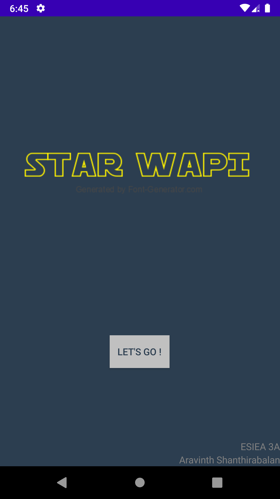
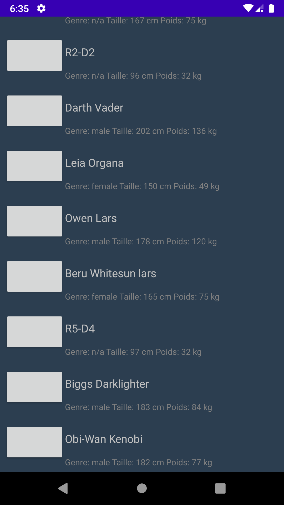
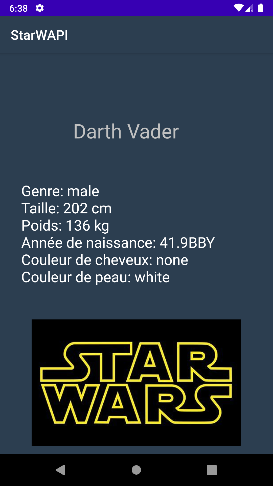

# Star WAPI
Voici mon projet Android de 3ème année d'ingénieur

Professeur : Vincent Etienne

# Présentation
Ce projet utilise une API Rest pour récupérer des données et les afficher.

# Prérequis
- Utiliser Android Studio
- Récuperer le projet [sur ce lien](https://github.com/Aravinth9/Android3A.git)

>  Les fichiers se trouvent dans le dossier StarWAPI ([ce dossier là](https://github.com/Aravinth9/Android3A/tree/master/StarWAPI) (je n'arrive pas à supprimer les fichiers inutiles)

# Consignes respectées :
 - Architecture MVC
 - Appel REST
 - Affichage d'une liste dans un RecyclerView
 - Activité pour le détail d'un élément
 - Stockage de données en cache
 
# Fonctionnalités :
Ecran d'accueil

Recycler View 

Ecran détails

